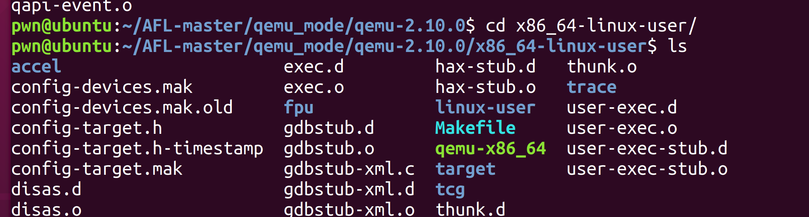

# qemu user emulation


先来了解一下qemu的用户模式,qemu可以单独运行一个其他架构的程序,同时也可以模拟出另一个架构的操作系统,在qemu进行模拟时,实际上存在一个指令翻译的过程,也就是TCG部分

初始化流程:

```C
qemu初始化,参数转储
tcg初始化
cpu初始化
加载可执行文件
syscall初始化
signal初始化
gdbserver初始化(可选项)
cpu_loop开始模拟
```

在这里qemu会分析elf结构,mmap分配内存将所需的库都读入内存,开始翻译->执行,并且在遇到中断时模拟syscall,

cpu_loop流程:

```C
for(;;)
{
	cpu_exec()
	switch(处理退出事件)
}
```

# afl qemu mode

```
1) Introduction
---------------

The code in this directory allows you to build a standalone feature that
leverages the QEMU "user emulation" mode and allows callers to obtain
instrumentation output for black-box, closed-source binaries. This mechanism
can be then used by afl-fuzz to stress-test targets that couldn't be built
with afl-gcc.

The usual performance cost is 2-5x, which is considerably better than
seen so far in experiments with tools such as DynamoRIO and PIN.

The idea and much of the implementation comes from Andrew Griffiths.
```

它是基于qemu user emulation模式的,也就是qemu的作用是运行程序和实时翻译模拟syscall,而不是system模式的模拟整个系统和外围硬件.

afl的qemu模式一般用于那些没有源码的文件fuzz,接下来解析一下qemu模式的原理

```shell
#!/bin/sh
#
# Copyright 2015 Google LLC All rights reserved.
#
# Licensed under the Apache License, Version 2.0 (the "License");
# you may not use this file except in compliance with the License.
# You may obtain a copy of the License at:
#
#   http://www.apache.org/licenses/LICENSE-2.0
#
# Unless required by applicable law or agreed to in writing, software
# distributed under the License is distributed on an "AS IS" BASIS,
# WITHOUT WARRANTIES OR CONDITIONS OF ANY KIND, either express or implied.
# See the License for the specific language governing permissions and
# limitations under the License.
# -----------------------------------------
# american fuzzy lop - QEMU build script
# --------------------------------------
#
# Written by Andrew Griffiths <agriffiths@google.com> and
#            Michal Zalewski <lcamtuf@google.com>
#
# This script downloads, patches, and builds a version of QEMU with
# minor tweaks to allow non-instrumented binaries to be run under
# afl-fuzz. 
#
# The modifications reside in patches/*. The standalone QEMU binary
# will be written to ../afl-qemu-trace.
#


VERSION="2.10.0"
QEMU_URL="http://download.qemu-project.org/qemu-${VERSION}.tar.xz"
QEMU_SHA384="68216c935487bc8c0596ac309e1e3ee75c2c4ce898aab796faa321db5740609ced365fedda025678d072d09ac8928105"

echo "================================================="
echo "AFL binary-only instrumentation QEMU build script"
echo "================================================="
echo

echo "[*] Performing basic sanity checks..."

if [ ! "`uname -s`" = "Linux" ]; then

  echo "[-] Error: QEMU instrumentation is supported only on Linux."
  exit 1

fi

if [ ! -f "patches/afl-qemu-cpu-inl.h" -o ! -f "../config.h" ]; then

  echo "[-] Error: key files not found - wrong working directory?"
  exit 1

fi

if [ ! -f "../afl-showmap" ]; then

  echo "[-] Error: ../afl-showmap not found - compile AFL first!"
  exit 1

fi


for i in libtool wget python automake autoconf sha384sum bison iconv; do

  T=`which "$i" 2>/dev/null`

  if [ "$T" = "" ]; then

    echo "[-] Error: '$i' not found, please install first."
    exit 1

  fi

done

if [ ! -d "/usr/include/glib-2.0/" -a ! -d "/usr/local/include/glib-2.0/" ]; then

  echo "[-] Error: devel version of 'glib2' not found, please install first."
  exit 1

fi

if echo "$CC" | grep -qF /afl-; then

  echo "[-] Error: do not use afl-gcc or afl-clang to compile this tool."
  exit 1

fi

echo "[+] All checks passed!"

ARCHIVE="`basename -- "$QEMU_URL"`"

CKSUM=`sha384sum -- "$ARCHIVE" 2>/dev/null | cut -d' ' -f1`

if [ ! "$CKSUM" = "$QEMU_SHA384" ]; then

  echo "[*] Downloading QEMU ${VERSION} from the web..."
  rm -f "$ARCHIVE"
  wget -O "$ARCHIVE" -- "$QEMU_URL" || exit 1

  CKSUM=`sha384sum -- "$ARCHIVE" 2>/dev/null | cut -d' ' -f1`

fi

if [ "$CKSUM" = "$QEMU_SHA384" ]; then

  echo "[+] Cryptographic signature on $ARCHIVE checks out."

else

  echo "[-] Error: signature mismatch on $ARCHIVE (perhaps download error?)."
  exit 1

fi

echo "[*] Uncompressing archive (this will take a while)..."

rm -rf "qemu-${VERSION}" || exit 1
tar xf "$ARCHIVE" || exit 1

echo "[+] Unpacking successful."

echo "[*] Configuring QEMU for $CPU_TARGET..."

ORIG_CPU_TARGET="$CPU_TARGET"

test "$CPU_TARGET" = "" && CPU_TARGET="`uname -m`"
test "$CPU_TARGET" = "i686" && CPU_TARGET="i386"

cd qemu-$VERSION || exit 1

echo "[*] Applying patches..."

patch -p1 <../patches/elfload.diff || exit 1
patch -p1 <../patches/cpu-exec.diff || exit 1
patch -p1 <../patches/syscall.diff || exit 1
patch -p1 <../patches/configure.diff || exit 1
patch -p1 <../patches/memfd.diff || exit 1

echo "[+] Patching done."

# --enable-pie seems to give a couple of exec's a second performance
# improvement, much to my surprise. Not sure how universal this is..

CFLAGS="-O3 -ggdb" ./configure --disable-system \
  --enable-linux-user --disable-gtk --disable-sdl --disable-vnc \
  --target-list="${CPU_TARGET}-linux-user" --enable-pie --enable-kvm || exit 1

echo "[+] Configuration complete."

echo "[*] Attempting to build QEMU (fingers crossed!)..."

make || exit 1

echo "[+] Build process successful!"

echo "[*] Copying binary..."

cp -f "${CPU_TARGET}-linux-user/qemu-${CPU_TARGET}" "../../afl-qemu-trace" || exit 1

cd ..
ls -l ../afl-qemu-trace || exit 1

echo "[+] Successfully created '../afl-qemu-trace'."

if [ "$ORIG_CPU_TARGET" = "" ]; then

  echo "[*] Testing the build..."

  cd ..

  make >/dev/null || exit 1

  gcc test-instr.c -o test-instr || exit 1

  unset AFL_INST_RATIO

  # We shouldn't need the /dev/null hack because program isn't compiled with any
  # optimizations.
  echo 0 | ./afl-showmap -m none -Q -q -o .test-instr0 ./test-instr || exit 1
  echo 1 | ./afl-showmap -m none -Q -q -o .test-instr1 ./test-instr || exit 1

  rm -f test-instr

  cmp -s .test-instr0 .test-instr1
  DR="$?"

  rm -f .test-instr0 .test-instr1

  if [ "$DR" = "0" ]; then

    echo "[-] Error: afl-qemu-trace instrumentation doesn't seem to work!"
    exit 1

  fi

  echo "[+] Instrumentation tests passed. "
  echo "[+] All set, you can now use the -Q mode in afl-fuzz!"

else

  echo "[!] Note: can't test instrumentation when CPU_TARGET set."
  echo "[+] All set, you can now (hopefully) use the -Q mode in afl-fuzz!"

fi

exit 0
```

可以看到前面是一些检测,包括变异检测和依赖库的检测

提交patch,然后configure,编译




然后将这个qemu-x86_64复制出去,重命名为afl-qemu-trace,并且测试是否生效,可以看到,最主要的地方就是在diff文件中,下面来分析diff文件

```diff
--- qemu-2.10.0-rc3-clean/linux-user/elfload.c	2017-08-15 11:39:41.000000000 -0700
+++ qemu-2.10.0-rc3/linux-user/elfload.c	2017-08-22 14:33:57.397127516 -0700
@@ -20,6 +20,8 @@
 
 #define ELF_OSABI   ELFOSABI_SYSV
 
+extern abi_ulong afl_entry_point, afl_start_code, afl_end_code;
+
 /* from personality.h */
 
 /*
@@ -2085,6 +2087,8 @@
     info->brk = 0;
     info->elf_flags = ehdr->e_flags;
 
+    if (!afl_entry_point) afl_entry_point = info->entry;
+
     for (i = 0; i < ehdr->e_phnum; i++) {
         struct elf_phdr *eppnt = phdr + i;
         if (eppnt->p_type == PT_LOAD) {
@@ -2118,9 +2122,11 @@
             if (elf_prot & PROT_EXEC) {
                 if (vaddr < info->start_code) {
                     info->start_code = vaddr;
+                    if (!afl_start_code) afl_start_code = vaddr;
                 }
                 if (vaddr_ef > info->end_code) {
                     info->end_code = vaddr_ef;
+                    if (!afl_end_code) afl_end_code = vaddr_ef;
                 }
             }
             if (elf_prot & PROT_WRITE) {

```

elfload中,新增了三个变量,入口点和代码的start,end.并且在elf文件解析时,获取这些地址

cpu-exec中

```diff
--- qemu-2.10.0-rc3-clean/accel/tcg/cpu-exec.c	2017-08-15 11:39:41.000000000 -0700
+++ qemu-2.10.0-rc3/accel/tcg/cpu-exec.c	2017-08-22 14:34:55.868730680 -0700
@@ -36,6 +36,8 @@
 #include "sysemu/cpus.h"
 #include "sysemu/replay.h"
 
+#include "../patches/afl-qemu-cpu-inl.h"
+
 /* -icount align implementation. */
 
 typedef struct SyncClocks {
@@ -144,6 +146,8 @@
     int tb_exit;
     uint8_t *tb_ptr = itb->tc_ptr;
 
+    AFL_QEMU_CPU_SNIPPET2;
+
     qemu_log_mask_and_addr(CPU_LOG_EXEC, itb->pc,
                            "Trace %p [%d: " TARGET_FMT_lx "] %s\n",
                            itb->tc_ptr, cpu->cpu_index, itb->pc,
@@ -365,6 +369,7 @@
             if (!tb) {
                 /* if no translated code available, then translate it now */
                 tb = tb_gen_code(cpu, pc, cs_base, flags, 0);
+                AFL_QEMU_CPU_SNIPPET1;
             }
 
             mmap_unlock();

```

可以看到加入了一个头文件,并且在两个位置加入了两端宏定义的东西

```C
/* A snippet patched into tb_find_slow to inform the parent process that
   we have hit a new block that hasn't been translated yet, and to tell
   it to translate within its own context, too (this avoids translation
   overhead in the next forked-off copy). */

#define AFL_QEMU_CPU_SNIPPET1 do { \
    afl_request_tsl(pc, cs_base, flags); \
  } while (0)

/* This snippet kicks in when the instruction pointer is positioned at
   _start and does the usual forkserver stuff, not very different from
   regular instrumentation injected via afl-as.h. */

#define AFL_QEMU_CPU_SNIPPET2 do { \
    if(itb->pc == afl_entry_point) { \
      afl_setup(); \
      afl_forkserver(cpu); \
    } \
    afl_maybe_log(itb->pc); \
  } while (0)

```

第二处patch是位于cpu_tb_exec,也就是执行TB的函数,在entry point的地方,执行afl_setup,并且fork,然后对于覆盖率的计算.

afl_request_tsl则是为了实现翻译的加速

syscall.diff

```diff
--- qemu-2.10.0-rc3-clean/linux-user/syscall.c	2017-08-15 11:39:41.000000000 -0700
+++ qemu-2.10.0-rc3/linux-user/syscall.c	2017-08-22 14:34:03.193088186 -0700
@@ -116,6 +116,8 @@
 
 #include "qemu.h"
 
+extern unsigned int afl_forksrv_pid;
+
 #ifndef CLONE_IO
 #define CLONE_IO                0x80000000      /* Clone io context */
 #endif
@@ -11688,8 +11690,21 @@
         break;
 
     case TARGET_NR_tgkill:
-        ret = get_errno(safe_tgkill((int)arg1, (int)arg2,
-                        target_to_host_signal(arg3)));
+
+        {
+          int pid  = (int)arg1,
+              tgid = (int)arg2,
+              sig  = (int)arg3;
+
+          /* Not entirely sure if the below is correct for all architectures. */
+
+          if(afl_forksrv_pid && afl_forksrv_pid == pid && sig == SIGABRT)
+              pid = tgid = getpid();
+
+          ret = get_errno(safe_tgkill(pid, tgid, target_to_host_signal(sig)));
+
+        }
+
         break;
 
 #ifdef TARGET_NR_set_robust_list
```

在异常处理中,记录

综上,afl在patch后的qemu的代码翻译阶段加入指令插装代码,在entry point时初始化插装,然后计算覆盖率进行计算

