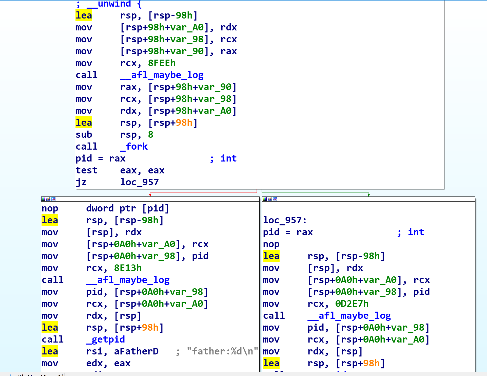
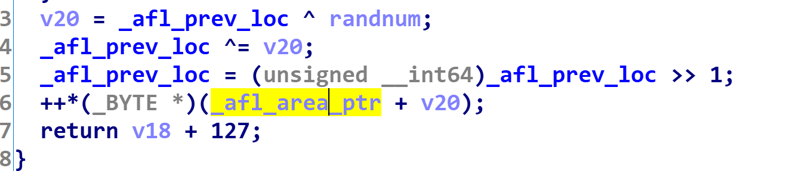
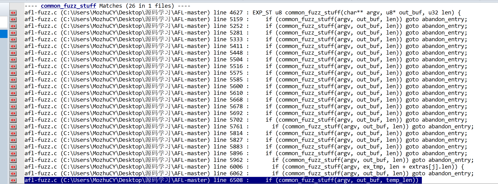

AFL是现在最热门的fuzz工具之一,自发布以来,通过AFL找到的漏洞不计其数,在近些年,也产生了许多由AFL衍生而来的fuzzer,例如uni-afl,他们都是为了解决不同架构,不同二进制文件产生的.

AFL的原理其实很简单,就是变异加上覆盖率的计算,其中,有源码和无源码的fuzz是不一样的.

# afl-gcc

有源码的时候,我们可以用afl-gcc/afl-g++编译源码,afl会在编译的时候以每个基本块为单位,进行代码插桩.

```C
fprintf(outf, use_64bit ? trampoline_fmt_64 : trampoline_fmt_32, R(MAP_SIZE));
```

通过上述程序,将代码插入,R(MAP_SIZE)则是生成一个随机数,即每个代码块都对应着一个随机数.在运行时,afl会实现一个共享的64K大小的MAP,来计算覆盖率

在编译完成后,我们得到了一个插好装的二进制文件



可以看到在每个基本块开始前,都被插入了两端代码,且RCX的值是变化的.



而在__afl_maybe_log中,可以看到其实是在通过这样的方式计算对应的index,然后对于index做加法,来计算执行路径的次数

# 开始fuzz

这里采用的是fork,在子进程中,初始化管道,和父进程的fuzzer进行通信,在运行时,父进程会读取状态管道,来验证fork server是都创建完成

可以看到__afl_maybe_log中,除了路径的记录,更多的代码其实是初始化整个fuzzer,首先fork server会初始化,然后通过管道通知fuzzer已经准备就绪,然后循环等待fuzzer通知开始fork,当fork server接收到消息后,再次调用fork,子进程继续执行target,而父进程继续作为fork server进行,并且通过状态管道将状态发送给fuzzer

在子进程开始和结束的时候,fork server都会发送给fuzz此时子进程的状态,在完成一次fork后,会再次进入到__afl_fork_wait_loop的地方等待下一次loop


# MAP

由于AFL是需要配合覆盖率决定变异的,所以需要再fuzzer和target中,都需要读写记录覆盖率的MAP,这里也是在__afl_maybe_log中实现的,由getenv("\_\_AFL_SHM_ID")和shmat所实现,而最初的shared memory是由setup_shm初始化的.

# 分支记录的细节

右移一位是为了解决A->A的问题,以及A->B B->A的不同.


#  fuzz_one

在这里是变异的过程

从队列取出文件名,打开映射到内存中,orig_in和in_buf两个指针指向这块内存

```C
#define FLIP_BIT(_ar, _b) do { \
    u8* _arf = (u8*)(_ar); \
    u32 _bf = (_b); \
    _arf[(_bf) >> 3] ^= (128 >> ((_bf) & 7)); \
  } while (0)
```

然后开始FLIP_BIT写入output,common_fuzz_stuff执行程序



后续还有很多的调用的位置,而fuzz_one是由afl-fuzz的main函数调用的


参考文章:

https://rk700.github.io/2017/12/28/afl-internals/