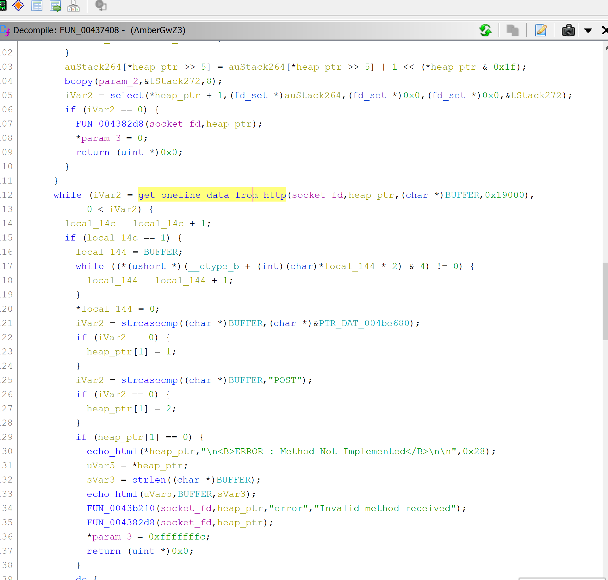
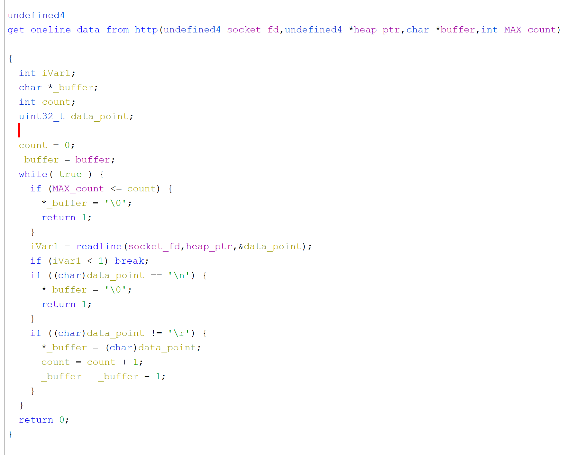
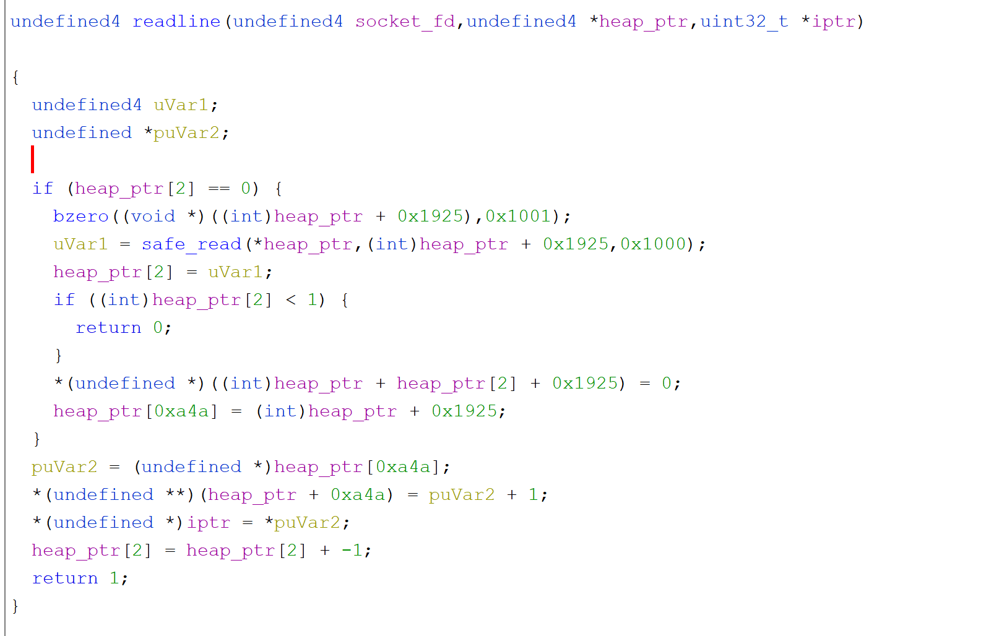
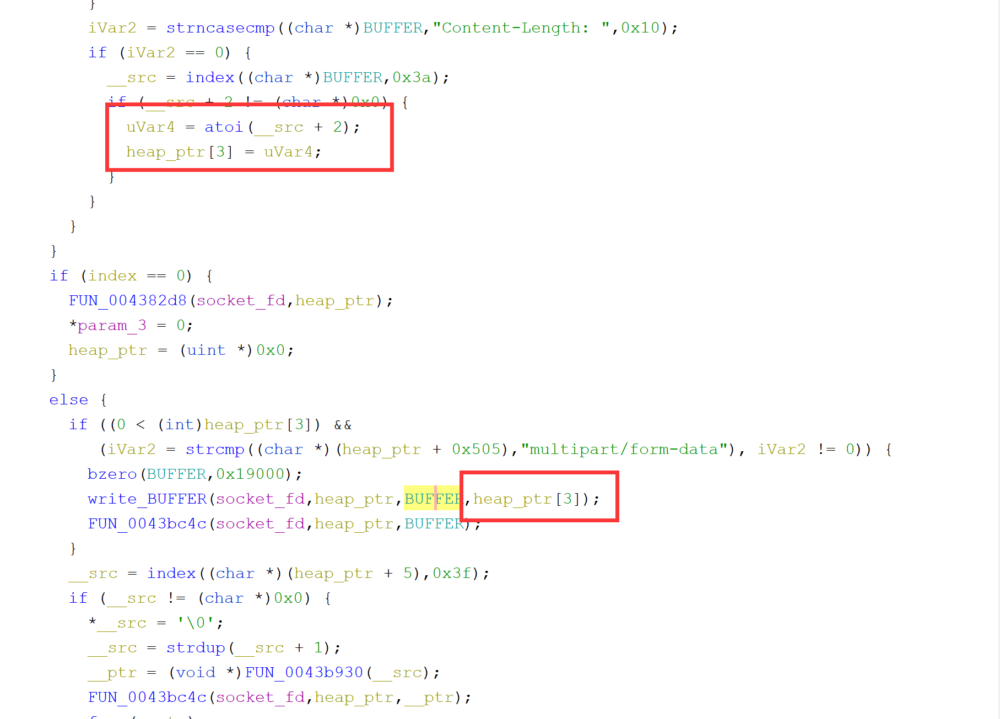

# 对某路由器组件的逆向记录

mips架构,使用IDA配合ghidra分析

nmap可以扫描到端口9998,这里开启了一个http服务

定位处理代码后,开始逆向



定位到这里,其中socked_fd是最初初始化时创建的,是一个全局变量,heap_ptr是一个buffer,在此函数头部申请,大小0x353c,在上面有这样一个操作:

```
    uVar5 = accept(*(int *)(socket_fd + 4),(sockaddr *)auStack136,&local_114);
    *heap_ptr = uVar5;
    ...
    heap_ptr[2] = 0;
    heap_ptr[0xa4a] = 0;
```

在get_oneline_data_from_http中,用到这这些



可以看到最多只能读取MAX_count的数据,也就是102400长度的数据,buffer长度是在bss段上的,长度也为102400,主要的逻辑在readline函数中



这里可以大概看出来heap结构体的形式

```
hptr + 0: accept_fd
hptr + 1: type
hptr + 2: data_len
hptr + 3: Content-Length
hptr + 5: url_buf
hptr + 0x105: host_buf
hptr + 0x305: referer_buf
hptr + 0x405: If-Modified-Since_buf
hptr + 0x505: Content-Type_buf
hptr + 0xa4a: current_data_ptr
hptr + 0x1925: tmp_buf
hptr + 0x3538: cookie_list
```

这个get_one_line_data_from_http的逻辑就是读取fd到堆上的临时空间,然后逐字节复制到buf中,终止条件是遇到回车或者长度超过限制长度 (可以写0,结束仅判断是否为回车


```
        if (index == 1) {
          LBUF = BUFFER;
          while ((*(ushort *)(__ctype_b + (int)(char)*LBUF * 2) & 4) != 0) {
            LBUF = LBUF + 1;
          }
          *LBUF = 0;
          iVar2 = strcasecmp((char *)BUFFER,"GET");
          if (iVar2 == 0) {
            heap_ptr[1] = 1;
          }
          iVar2 = strcasecmp((char *)BUFFER,"POST");
          if (iVar2 == 0) {
            heap_ptr[1] = 2;
          }
          if (heap_ptr[1] == 0) {
            echo_html(*heap_ptr,"\n<B>ERROR : Method Not Implemented</B>\n\n",0x28);
            uVar5 = *heap_ptr;
            sVar3 = strlen((char *)BUFFER);
            echo_html(uVar5,BUFFER,sVar3);
            FUN_0043b2f0(socket_fd,heap_ptr,"error","Invalid method received");
            FUN_004382d8(socket_fd,heap_ptr);
            *param_3 = 0xfffffffc;
            return (uint *)0x0;
          }
          do {
            local_148 = LBUF + 1;
            LBUF = local_148;
          } while (*local_148 == 0x20);
          LBUF = local_148;
          while ((*LBUF != 0x20 && (*LBUF != 0))) {
            LBUF = LBUF + 1;
          }
          *LBUF = 0;
          strncpy((char *)(heap_ptr + 5),(char *)local_148,0x400);
          waf(heap_ptr + 5);
        }
```


在处理line数据中,调用了ispunct函数过滤了如下

```
33:!    34:"    35:#    36:$    37:%    38:&    39:'    40:(    41:)    42:*    43:+    44:,    45:-    46:.    47:/    58::    59:;    60:<    61:=    62:>    63:?    64:@    91:[    92:\    93:]    94:^    95:_    96:`    123:{   124:|   125:}   126:~
```

waf函数:

> // => /                  /./=>/                     /../=>/

这里主要是处理了url,将访问的目录储存了起来

```C
        else {
          if (BUFFER[0] == 0) break;
          result = strncasecmp((char *)BUFFER,"Cookie: ",7);
          if (result == 0) {
            local_138 = index((char *)BUFFER,0x3a);
            while (local_138 != (char *)0x0) {
              __src = local_138 + 1;
              pcVar4 = index(__src,0x3d);
              *pcVar4 = '\0';
              local_138 = index(pcVar4 + 1,0x3b);
              if (local_138 != (char *)0x0) {
                *local_138 = '\0';
              }
              FUN_00436d64(socket_fd,heap_ptr,__src,pcVar4 + 1);
            }
          }
          iVar2 = strncasecmp((char *)BUFFER,"Authorization: ",0xf);
          if (iVar2 == 0) {
            __src = index((char *)BUFFER,0x3a);
            iVar2 = strncmp(__src + 2,"Basic ",6);
            if (iVar2 == 0) {
              __src = index(__src + 2,0x20);
              FUN_0043b434(__src + 1,acStack120,100);
              sVar3 = strlen(acStack120);
              heap_ptr[4] = sVar3;
              __src = index(acStack120,0x3a);
              if (__src != (char *)0x0) {
                *__src = '\0';
                strncpy((char *)(heap_ptr + 0x625),__src + 1,0x80);
              }
              strncpy((char *)(heap_ptr + 0x605),acStack120,0x80);
            }
          }
          iVar2 = strncasecmp((char *)BUFFER,"Host: ",6);
          if (iVar2 == 0) {
            __src = index((char *)BUFFER,0x3a);
            if (__src + 2 != (char *)0x0) {
              strncpy((char *)(heap_ptr + 0x105),__src + 2,0x400);
            }
          }
          iVar2 = strncasecmp((char *)BUFFER,"Referer: ",9);
          if (iVar2 == 0) {
            __src = index((char *)BUFFER,0x3a);
            if (__src + 2 != (char *)0x0) {
              strncpy((char *)(heap_ptr + 0x305),__src + 2,0x400);
            }
          }
          iVar2 = strncasecmp((char *)BUFFER,"If-Modified-Since: ",0x13);
          if (iVar2 == 0) {
            __src = index((char *)BUFFER,0x3a);
            if (__src + 2 != (char *)0x0) {
              strncpy((char *)(heap_ptr + 0x405),__src + 2,0x400);
              __src = index((char *)(heap_ptr + 0x405),0x3b);
              if (__src != (char *)0x0) {
                *__src = '\0';
              }
            }
          }
          iVar2 = strncasecmp((char *)BUFFER,"Content-Type: ",0xe);
          if (iVar2 == 0) {
            __src = index((char *)BUFFER,0x3a);
            if (__src + 2 != (char *)0x0) {
              strncpy((char *)(heap_ptr + 0x505),__src + 2,0x400);
            }
          }
          iVar2 = strncasecmp((char *)BUFFER,"Content-Length: ",0x10);
          if (iVar2 == 0) {
            __src = index((char *)BUFFER,0x3a);
            if (__src + 2 != (char *)0x0) {
              uVar5 = atoi(__src + 2);
              heap_ptr[3] = uVar5;
            }
          }
        }
```


cookie_parser函数:

```C

undefined4 cookie_parser(undefined4 socket_fd,int heap_ptr,char *arg,char *var)

{
  undefined4 uVar1;
  char **__s;
  char *pcVar2;
  int iVar3;
  char *Arg;
  char **wtf;
  char **local_14;
  
  if ((arg == (char *)0x0) || (Arg = arg, var == (char *)0x0)) {
    uVar1 = 0xffffffff;
  }
  else {
    while ((*Arg == ' ' || (*Arg == '\t'))) {
      Arg = Arg + 1;
    }
    __s = (char **)malloc(0x10);
    bzero(__s,0x10);
    pcVar2 = strdup(Arg);
    *__s = pcVar2;
    pcVar2 = strdup(var);
    __s[1] = pcVar2;
    local_14 = (char **)0x0;
    wtf = *(char ***)(heap_ptr + 0x3538);
    while (wtf != (char **)0x0) {
      iVar3 = strcmp(*wtf,Arg);
      if (iVar3 == 0) {
        while (wtf != (char **)0x0) {
          local_14 = wtf;
          wtf = (char **)wtf[2];
        }
        *(char ***)(local_14 + 2) = __s;
        return 0;
      }
      local_14 = wtf;
      wtf = (char **)wtf[3];
    }
    if (local_14 == (char **)0x0) {
      *(char ***)(heap_ptr + 0x3538) = __s;
    }
    else {
      *(char ***)(local_14 + 3) = __s;
    }
    uVar1 = 0;
  }
  return uVar1;
}
```

结构体

```C
typedef struct 
{
	char * arg;
    char * value;
    cookie * sameNamePtr;
    cookie * ptr;
}cookie;
```

heap_ptr + 0x3538是链表头,以链表的方式管理,这个函数不是只用于cookie_parser,这个函数是管理很多参数的




这里存在溢出,可以无限溢出bss段