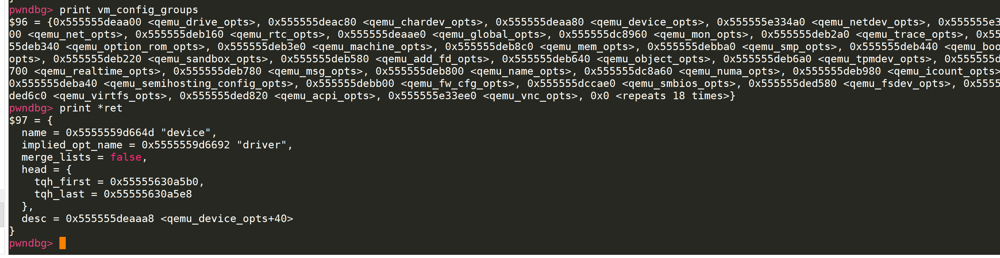
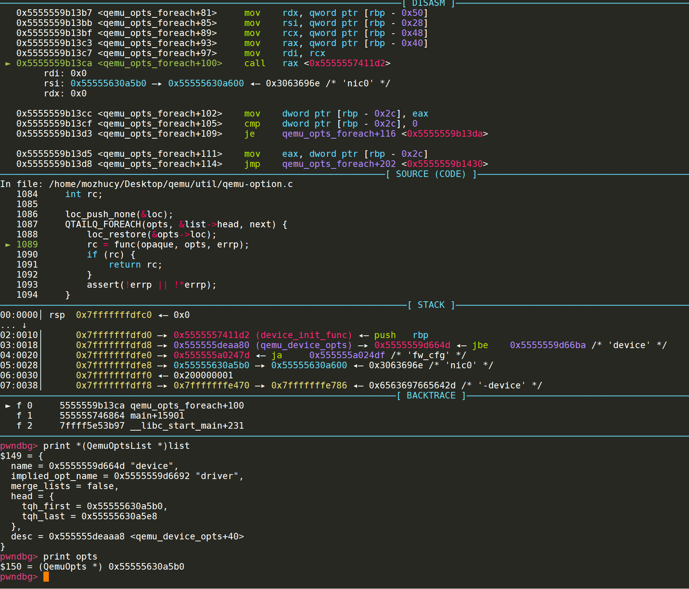
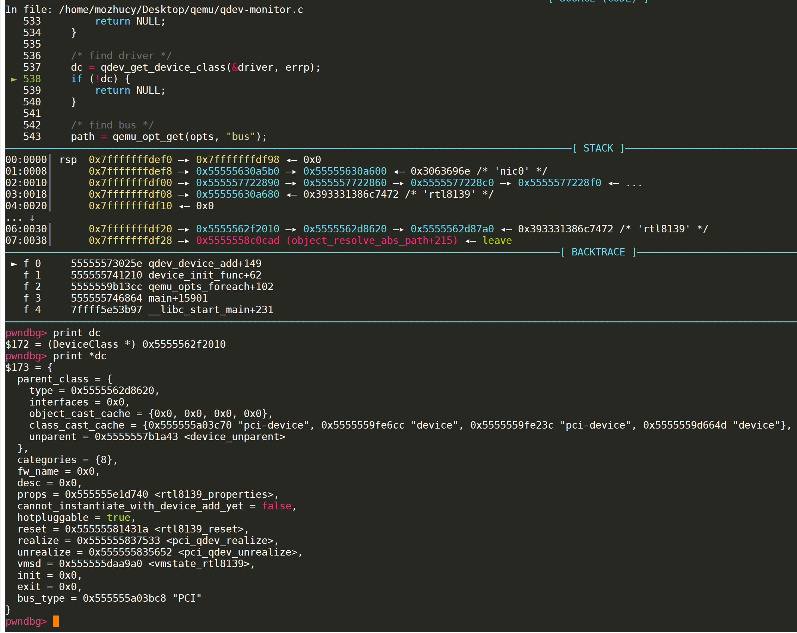
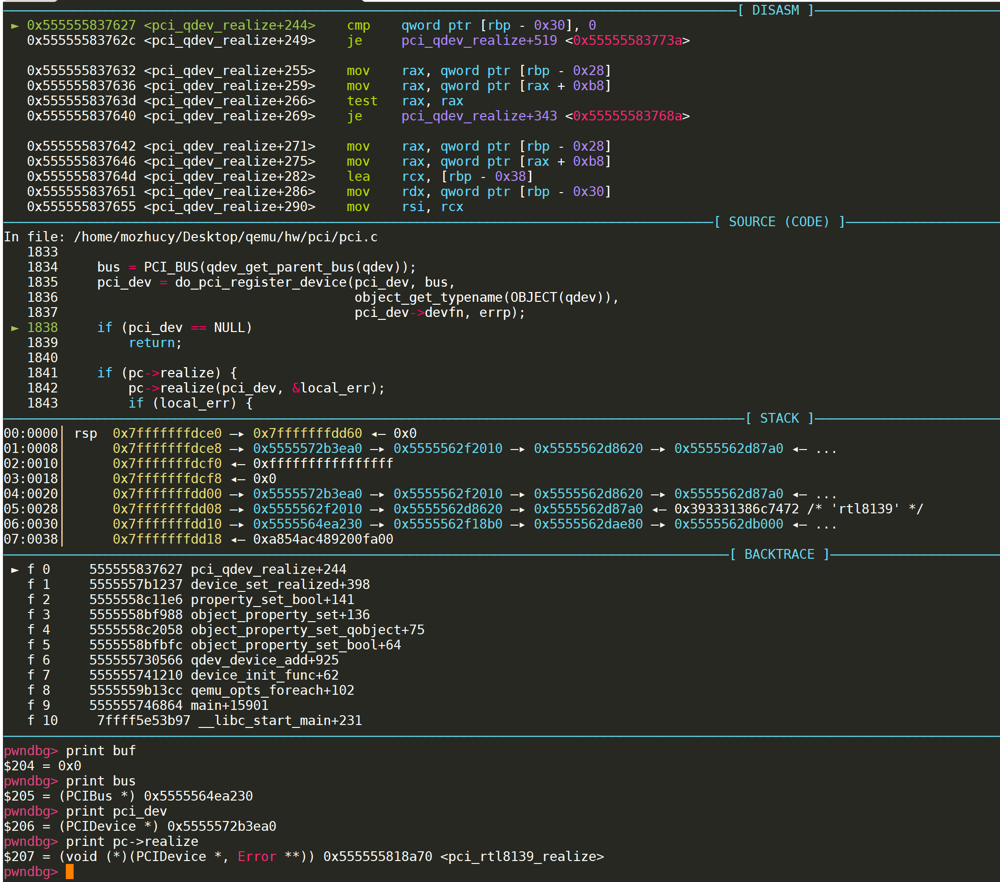

# PCI设备

PCI是Peripheral Component Interconnect(外设部件互连标准)的缩写，它是目前个人电脑中使用最为广泛的接口，几乎所有的主板产品上都带有这种插槽。一般来说像网卡等设备都属于pci设备,在各种虚拟化平台中,对于PCI设备的模拟也是必不可少的.http://oenhan.com/kvm-src-1

# QEMU中的pci设备

就拿rtl8139网卡举例,来分析pci设备的申请和初始化.[QOM](https://blog.csdn.net/lwhuq/article/details/98642184)

```C
static void rtl8139_instance_init(Object *obj)
{
    RTL8139State *s = RTL8139(obj);

    device_add_bootindex_property(obj, &s->conf.bootindex,
                                  "bootindex", "/ethernet-phy@0",
                                  DEVICE(obj), NULL);
}

static void rtl8139_class_init(ObjectClass *klass, void *data)
{
    DeviceClass *dc = DEVICE_CLASS(klass);
    PCIDeviceClass *k = PCI_DEVICE_CLASS(klass);

    k->realize = pci_rtl8139_realize;
    k->exit = pci_rtl8139_uninit;
    k->romfile = "efi-rtl8139.rom";
    k->vendor_id = PCI_VENDOR_ID_REALTEK;
    k->device_id = PCI_DEVICE_ID_REALTEK_8139;
    k->revision = RTL8139_PCI_REVID; /* >=0x20 is for 8139C+ */
    k->class_id = PCI_CLASS_NETWORK_ETHERNET;
    dc->reset = rtl8139_reset;
    dc->vmsd = &vmstate_rtl8139;
    dc->props = rtl8139_properties;
    set_bit(DEVICE_CATEGORY_NETWORK, dc->categories);
}

static const TypeInfo rtl8139_info = {
    .name          = TYPE_RTL8139,
    .parent        = TYPE_PCI_DEVICE,
    .instance_size = sizeof(RTL8139State),
    .class_init    = rtl8139_class_init,
    .instance_init = rtl8139_instance_init,
    .interfaces = (InterfaceInfo[]) {
        { INTERFACE_CONVENTIONAL_PCI_DEVICE },
        { },
    },
};

static void rtl8139_register_types(void)
{
    type_register_static(&rtl8139_info);
}

type_init(rtl8139_register_types)
```

首先是关于初始化的过程,由于qemu中所有的设备都是基于QOM的.主要相关的就是这个type_init,QOM的知识先略过,不做底层的分析

有两个需要注意的函数,就是TypeInfo中的两个init函数,分别是class_init和instance_init,class_init主要是表示这个对象,而instance_init是创建实例.这部分都是属于QOM相关部分,主要分析pci_rtl8139_realize

```c
static void pci_rtl8139_realize(PCIDevice *dev, Error **errp)
{
    RTL8139State *s = RTL8139(dev);
    DeviceState *d = DEVICE(dev);
    uint8_t *pci_conf;

    pci_conf = dev->config;
    pci_conf[PCI_INTERRUPT_PIN] = 1;    /* interrupt pin A */
    /* TODO: start of capability list, but no capability
     * list bit in status register, and offset 0xdc seems unused. */
    pci_conf[PCI_CAPABILITY_LIST] = 0xdc;

    memory_region_init_io(&s->bar_io, OBJECT(s), &rtl8139_io_ops, s,
                          "rtl8139", 0x100);
    memory_region_init_alias(&s->bar_mem, OBJECT(s), "rtl8139-mem", &s->bar_io,
                             0, 0x100);

    pci_register_bar(dev, 0, PCI_BASE_ADDRESS_SPACE_IO, &s->bar_io);
    pci_register_bar(dev, 1, PCI_BASE_ADDRESS_SPACE_MEMORY, &s->bar_mem);

    qemu_macaddr_default_if_unset(&s->conf.macaddr);

    /* prepare eeprom */
    s->eeprom.contents[0] = 0x8129;
#if 1
    /* PCI vendor and device ID should be mirrored here */
    s->eeprom.contents[1] = PCI_VENDOR_ID_REALTEK;
    s->eeprom.contents[2] = PCI_DEVICE_ID_REALTEK_8139;
#endif
    s->eeprom.contents[7] = s->conf.macaddr.a[0] | s->conf.macaddr.a[1] << 8;
    s->eeprom.contents[8] = s->conf.macaddr.a[2] | s->conf.macaddr.a[3] << 8;
    s->eeprom.contents[9] = s->conf.macaddr.a[4] | s->conf.macaddr.a[5] << 8;

    s->nic = qemu_new_nic(&net_rtl8139_info, &s->conf,
                          object_get_typename(OBJECT(dev)), d->id, s);
    qemu_format_nic_info_str(qemu_get_queue(s->nic), s->conf.macaddr.a);

    s->cplus_txbuffer = NULL;
    s->cplus_txbuffer_len = 0;
    s->cplus_txbuffer_offset = 0;

    s->timer = timer_new_ns(QEMU_CLOCK_VIRTUAL, rtl8139_timer, s);
}
```

首先用pci_conf进行中断和功能号的初始化.

然后调用了memory_region_init_io函数

```
memory_region_init_io(&s->bar_io, OBJECT(s), &rtl8139_io_ops, s,
                          "rtl8139", 0x100);
void memory_region_init_io(MemoryRegion *mr,
                           Object *owner,
                           const MemoryRegionOps *ops,
                           void *opaque,
                           const char *name,
                           uint64_t size)
{
    memory_region_init(mr, owner, name, size);
    mr->ops = ops ? ops : &unassigned_mem_ops;
    mr->opaque = opaque;
    mr->terminates = true;
}
void memory_region_init(MemoryRegion *mr,
                        Object *owner,
                        const char *name,
                        uint64_t size)
{
    object_initialize(mr, sizeof(*mr), TYPE_MEMORY_REGION);
    memory_region_do_init(mr, owner, name, size);
}
```

首先可以看到传入的参数,函数将rtl8139_io_ops和RTL8139State直接给了mr,其余部分继续传入memory_region_init进行处理,执行object_initialize,传入参数为mr和size(mr) TYPE_MEMORY_REGION,后面就进入到了object.c里面的对象初始化的过程,应该是对于MemoryRegion进行一些初始化

然后调用到了memory_region_do_init

```C
static void memory_region_do_init(MemoryRegion *mr,
                                  Object *owner,
                                  const char *name,
                                  uint64_t size)
{
    mr->size = int128_make64(size);
    if (size == UINT64_MAX) {
        mr->size = int128_2_64();
    }
    mr->name = g_strdup(name);
    mr->owner = owner;
    mr->ram_block = NULL;

    if (name) {
        char *escaped_name = memory_region_escape_name(name);
        char *name_array = g_strdup_printf("%s[*]", escaped_name);

        if (!owner) {
            owner = container_get(qdev_get_machine(), "/unattached");
        }

        object_property_add_child(owner, name_array, OBJECT(mr), &error_abort);
        object_unref(OBJECT(mr));
        g_free(name_array);
        g_free(escaped_name);
    }
}
```

也是直接将szie,name,owner等直接赋值给mr,后面就是一些安全保护了memory_region_escape_name会过滤`\/[]`等字符,综上memory_region_init_io函数并没有涉及到关于内存的模拟,只是进行了mr结构体的一些初始化


那么接下来要分析的就是pci_register_bar这样一个函数了

```C
pci_register_bar(dev, 0, PCI_BASE_ADDRESS_SPACE_IO, &s->bar_io);

void pci_register_bar(PCIDevice *pci_dev, int region_num,
                      uint8_t type, MemoryRegion *memory)
{
    PCIIORegion *r;
    uint32_t addr; /* offset in pci config space */
    uint64_t wmask;
    pcibus_t size = memory_region_size(memory);

    assert(region_num >= 0);
    assert(region_num < PCI_NUM_REGIONS);
    if (size & (size-1)) {
        error_report("ERROR: PCI region size must be pow2 "
                    "type=0x%x, size=0x%"FMT_PCIBUS"", type, size);
        exit(1);
    }

    r = &pci_dev->io_regions[region_num];
    r->addr = PCI_BAR_UNMAPPED;
    r->size = size;
    r->type = type;
    r->memory = memory;
    r->address_space = type & PCI_BASE_ADDRESS_SPACE_IO
                        ? pci_get_bus(pci_dev)->address_space_io
                        : pci_get_bus(pci_dev)->address_space_mem;

    wmask = ~(size - 1);
    if (region_num == PCI_ROM_SLOT) {
        /* ROM enable bit is writable */
        wmask |= PCI_ROM_ADDRESS_ENABLE;
    }

    addr = pci_bar(pci_dev, region_num);
    pci_set_long(pci_dev->config + addr, type);

    if (!(r->type & PCI_BASE_ADDRESS_SPACE_IO) &&
        r->type & PCI_BASE_ADDRESS_MEM_TYPE_64) {
        pci_set_quad(pci_dev->wmask + addr, wmask);
        pci_set_quad(pci_dev->cmask + addr, ~0ULL);
    } else {
        pci_set_long(pci_dev->wmask + addr, wmask & 0xffffffff);
        pci_set_long(pci_dev->cmask + addr, 0xffffffff);
    }
}
```

传入参数为PCIDevice,region_num,内存类型,刚才初始化的mr

首先获取size,查看memory_region_size函数,发现这里的size就是返回的初始化时传入的size参数的,也就是0x100

然后会根据传入的region_num,来进行PCIIORegion的选择,region_num的范围是0到6,处于PCIDevice有一个长度为7的PCIIORegion数组,这里选出来后,先进行初始化

address_space的初始化比较复杂,会根据type,选择PCIDevice中最底层的PCIBus中的mem和io地址空间赋值给PCIIORegion的对应位置

```C
struct PCIBus {
    BusState qbus;
    enum PCIBusFlags flags;
    PCIIOMMUFunc iommu_fn;
    void *iommu_opaque;
    uint8_t devfn_min;
    uint32_t slot_reserved_mask;
    pci_set_irq_fn set_irq;
    pci_map_irq_fn map_irq;
    pci_route_irq_fn route_intx_to_irq;
    void *irq_opaque;
    PCIDevice *devices[PCI_SLOT_MAX * PCI_FUNC_MAX];
    PCIDevice *parent_dev;
    MemoryRegion *address_space_mem;
    MemoryRegion *address_space_io;

    QLIST_HEAD(, PCIBus) child; /* this will be replaced by qdev later */
    QLIST_ENTRY(PCIBus) sibling;/* this will be replaced by qdev later */

    /* The bus IRQ state is the logical OR of the connected devices.
       Keep a count of the number of devices with raised IRQs.  */
    int nirq;
    int *irq_count;

    Notifier machine_done;
};
```


在调试的过程中,遍历了一下devices数组,发现里面存储着许多的PCI设备的PCIDevice,包括了rtl8139网卡的Device

后面的几步就是设置掩码还有一些其他数据,然后就注册完毕了.

后面的操作还剩两步,一个是将rtl8139加入到qemu的nic队列,然后就是初始化timer成员.


这里我还查看了一下调用栈.

```
pwndbg> backtrace
#0  pci_rtl8139_realize (dev=0x5555572b3ea0, errp=0x7fffffffdcf8) at /home/mozhucy/Desktop/qemu/hw/net/rtl8139.c:3474
#1  0x000055555583765d in pci_qdev_realize (qdev=0x5555572b3ea0, errp=0x7fffffffdd60) at /home/mozhucy/Desktop/qemu/hw/pci/pci.c:1842
#2  0x00005555557b1237 in device_set_realized (obj=0x5555572b3ea0, value=true, errp=0x7fffffffdf10) at /home/mozhucy/Desktop/qemu/hw/core/qdev.c:1046
#3  0x00005555558c11e6 in property_set_bool (obj=0x5555572b3ea0, v=0x5555563600e0, opaque=0x5555564ef4e0, name=0x5555559d68a1 "realized", errp=0x7fffffffdf10) at /home/mozhucy/Desktop/qemu/qom/object.c:1667
#4  0x00005555558bf988 in object_property_set (obj=0x5555572b3ea0, v=0x5555563600e0, name=0x5555559d68a1 "realized", errp=0x7fffffffdf10) at /home/mozhucy/Desktop/qemu/qom/object.c:946
#5  0x00005555558c2058 in object_property_set_qobject (obj=0x5555572b3ea0, value=0x55555635d470, name=0x5555559d68a1 "realized", errp=0x7fffffffdf10) at /home/mozhucy/Desktop/qemu/qom/qom-qobject.c:24
#6  0x00005555558bfbfc in object_property_set_bool (obj=0x5555572b3ea0, value=true, name=0x5555559d68a1 "realized", errp=0x7fffffffdf10) at /home/mozhucy/Desktop/qemu/qom/object.c:1015
#7  0x0000555555730566 in qdev_device_add (opts=0x55555630a5b0, errp=0x7fffffffdf98) at /home/mozhucy/Desktop/qemu/qdev-monitor.c:599
#8  0x0000555555741210 in device_init_func (opaque=0x0, opts=0x55555630a5b0, errp=0x0) at /home/mozhucy/Desktop/qemu/vl.c:2300
#9  0x00005555559b13cc in qemu_opts_foreach (list=0x555555deaa80 <qemu_device_opts>, func=0x5555557411d2 <device_init_func>, opaque=0x0, errp=0x0) at /home/mozhucy/Desktop/qemu/util/qemu-option.c:1089
#10 0x0000555555746864 in main (argc=15, argv=0x7fffffffe408, envp=0x7fffffffe488) at /home/mozhucy/Desktop/qemu/vl.c:4532
#11 0x00007ffff5e53b97 in __libc_start_main (main=0x555555742a47 <main>, argc=15, argv=0x7fffffffe408, init=<optimized out>, fini=<optimized out>, rtld_fini=<optimized out>, stack_end=0x7fffffffe3f8) at ../csu/libc-start.c:310
#12 0x00005555555f2ee9 in _start ()
```

```
__libc_start_main
	main
		qemu_opts_foreach
			device_init_func
				qdev_device_add
					object_property_set_bool
						object_property_set_qobject
							object_property_set
								property_set_bool
									device_set_realized
										pci_qdev_realize
											pci_rtl8139_realize
```


从main函数开始读一下源码,在vl.c:4532附近,发现在这里,qemu开始初始化USB设备通用设备.也就是在main_loop开始之前,进行的初始化操作.

```C
int main()
{
    .....
        
	/* init USB devices */
    if (usb_enabled()) {
        if (foreach_device_config(DEV_USB, usb_parse) < 0)
            exit(1);
    }

    /* init generic devices */
    if (qemu_opts_foreach(qemu_find_opts("device"),
                          device_init_func, NULL, NULL)) {
        exit(1);
    }
    
    ......
    main_loop();
    ......
}
```

第一个参数是qemu_find_opts("device")

```C
QemuOptsList *qemu_find_opts(const char *group)
{
    QemuOptsList *ret;
    Error *local_err = NULL;

    ret = find_list(vm_config_groups, group, &local_err);
    if (local_err) {
        error_report_err(local_err);
    }

    return ret;
}
```

其中vm_config_groups是一个长度为48的一个数组,每个成员都是一个链表的表头,而这些链表中包括这了启动时的各种参数.



取出符合条件的双链链表表头,然后传入foreach遍历,调用



可以看到device_init_func的第二个参数是list.head.tqh_frist

```C
static int device_init_func(void *opaque, QemuOpts *opts, Error **errp)
{
    Error *err = NULL;
    DeviceState *dev;

    dev = qdev_device_add(opts, &err);
    if (!dev) {
        error_report_err(err);
        return -1;
    }
    object_unref(OBJECT(dev));
    return 0;
}
```

然后调用qdev_device_add

```C
DeviceState *qdev_device_add(QemuOpts *opts, Error **errp)
{//opts为vm_config_groups[2].head.tqh_frist
    DeviceClass *dc;
    const char *driver, *path, *id;
    DeviceState *dev;
    BusState *bus = NULL;
    Error *err = NULL;

    driver = qemu_opt_get(opts, "driver"); //从opts这个双向链表头遍历opt,找到符合name为driver的opt的str
    if (!driver) {
        error_setg(errp, QERR_MISSING_PARAMETER, "driver");
        return NULL;
    }

    /* find driver */
    dc = qdev_get_device_class(&driver, errp);//从注册过的class中找到名为rtl8139的class,然后返回dc
    if (!dc) {
        return NULL;
    }

    /* find bus */
    path = qemu_opt_get(opts, "bus");//寻找bus参数
    if (path != NULL) {
        bus = qbus_find(path, errp);
        if (!bus) {
            return NULL;
        }
        if (!object_dynamic_cast(OBJECT(bus), dc->bus_type)) {
            error_setg(errp, "Device '%s' can't go on %s bus",
                       driver, object_get_typename(OBJECT(bus)));
            return NULL;
        }
    } else if (dc->bus_type != NULL) {
        bus = qbus_find_recursive(sysbus_get_default(), NULL, dc->bus_type);
        if (!bus || qbus_is_full(bus)) {
            error_setg(errp, "No '%s' bus found for device '%s'",
                       dc->bus_type, driver);
            return NULL;
        }
    }
    if (qdev_hotplug && bus && !qbus_is_hotpluggable(bus)) {
        error_setg(errp, QERR_BUS_NO_HOTPLUG, bus->name);
        return NULL;
    }

    /* create device */
    dev = DEVICE(object_new(driver));//创建设备对象实例DeviceState

    if (bus) {
        qdev_set_parent_bus(dev, bus);
    }

    id = qemu_opts_id(opts);//获取id参数,这里启动脚本是id=nic0,所以返回了nic0
    if (id) {
        dev->id = id;
    }

    if (dev->id) {
        object_property_add_child(qdev_get_peripheral(), dev->id,
                                  OBJECT(dev), NULL);//调试的时候发现parent被赋值,应该是nic作为rtl网卡的父类的原因.
    } else {
        static int anon_count;
        gchar *name = g_strdup_printf("device[%d]", anon_count++);
        object_property_add_child(qdev_get_peripheral_anon(), name,
                                  OBJECT(dev), NULL);
        g_free(name);
    }

    /* set properties */
    if (qemu_opt_foreach(opts, set_property, dev, &err)) {
        error_propagate(errp, err);
        object_unparent(OBJECT(dev));
        object_unref(OBJECT(dev));
        return NULL;
    }

    dev->opts = opts;
    object_property_set_bool(OBJECT(dev), true, "realized", &err);
    if (err != NULL) {
        error_propagate(errp, err);
        dev->opts = NULL;
        object_unparent(OBJECT(dev));
        object_unref(OBJECT(dev));
        return NULL;
    }
    return dev;
}
```

首先从链表头开始遍历device链表,找到对应参数为device的str,这里返回的是rtl8139,然后用这个名字在hash表中寻找对应的类,并且初始化实例,返回DeviceClass,如下所示



然后查了一下bus参数,咱也不知道咱也不敢说,先跳过这个奇怪的东西,解析id参数然后经过一堆检查,到了object_property_set_bool,在一堆对象层层调用后,执行了一个set函数,然后就到了这里device_set_realized

```C
static void device_set_realized(Object *obj, bool value, Error **errp)
{
    DeviceState *dev = DEVICE(obj);
    DeviceClass *dc = DEVICE_GET_CLASS(dev);
    HotplugHandler *hotplug_ctrl;
    BusState *bus;
    Error *local_err = NULL;

    if (dev->hotplugged && !dc->hotpluggable) { //热插拔相关
        error_setg(errp, QERR_DEVICE_NO_HOTPLUG, object_get_typename(obj));
        return;
    }

    if (value && !dev->realized) {//是否realized
        if (!obj->parent) {
            static int unattached_count;
            gchar *name = g_strdup_printf("device[%d]", unattached_count++);

            object_property_add_child(container_get(qdev_get_machine(),
                                                    "/unattached"),
                                      name, obj, &error_abort);
            g_free(name);
        }

        if (dc->realize) {
            dc->realize(dev, &local_err); //执行pci_qdev_realize
        }

        if (local_err != NULL) {
            goto fail;
        }

        DEVICE_LISTENER_CALL(realize, Forward, dev);

        hotplug_ctrl = qdev_get_hotplug_handler(dev);
        if (hotplug_ctrl) {
            hotplug_handler_plug(hotplug_ctrl, dev, &local_err);
        }

        if (local_err != NULL) {
            goto post_realize_fail;
        }

        if (qdev_get_vmsd(dev)) {
            vmstate_register_with_alias_id(dev, -1, qdev_get_vmsd(dev), dev,
                                           dev->instance_id_alias,
                                           dev->alias_required_for_version);
        }

        QLIST_FOREACH(bus, &dev->child_bus, sibling) {
            object_property_set_bool(OBJECT(bus), true, "realized",
                                         &local_err);
            if (local_err != NULL) {
                goto child_realize_fail;
            }
        }
        if (dev->hotplugged) {
            device_reset(dev);
        }
        dev->pending_deleted_event = false;
    } else if (!value && dev->realized) {
        Error **local_errp = NULL;
        QLIST_FOREACH(bus, &dev->child_bus, sibling) {
            local_errp = local_err ? NULL : &local_err;
            object_property_set_bool(OBJECT(bus), false, "realized",
                                     local_errp);
        }
        if (qdev_get_vmsd(dev)) {
            vmstate_unregister(dev, qdev_get_vmsd(dev), dev);
        }
        if (dc->unrealize) {
            local_errp = local_err ? NULL : &local_err;
            dc->unrealize(dev, local_errp);
        }
        dev->pending_deleted_event = true;
        DEVICE_LISTENER_CALL(unrealize, Reverse, dev);
    }

    if (local_err != NULL) {
        goto fail;
    }

    dev->realized = value;
    return;

child_realize_fail:
    QLIST_FOREACH(bus, &dev->child_bus, sibling) {
        object_property_set_bool(OBJECT(bus), false, "realized",
                                 NULL);
    }

    if (qdev_get_vmsd(dev)) {
        vmstate_unregister(dev, qdev_get_vmsd(dev), dev);
    }

post_realize_fail:
    if (dc->unrealize) {
        dc->unrealize(dev, NULL);
    }

fail:
    error_propagate(errp, local_err);
    return;
}
```

判断是否realize,然后进入pci_qdev_realize函数

```C
static void pci_qdev_realize(DeviceState *qdev, Error **errp)
{
    PCIDevice *pci_dev = (PCIDevice *)qdev;
    PCIDeviceClass *pc = PCI_DEVICE_GET_CLASS(pci_dev);
    Error *local_err = NULL;
    PCIBus *bus;
    bool is_default_rom;

    /* initialize cap_present for pci_is_express() and pci_config_size() */
    if (pc->is_express) {
        pci_dev->cap_present |= QEMU_PCI_CAP_EXPRESS;
    }

    bus = PCI_BUS(qdev_get_parent_bus(qdev));
    pci_dev = do_pci_register_device(pci_dev, bus,
                                     object_get_typename(OBJECT(qdev)),
                                     pci_dev->devfn, errp);
    if (pci_dev == NULL)
        return;

    if (pc->realize) {
        pc->realize(pci_dev, &local_err);
        if (local_err) {
            error_propagate(errp, local_err);
            do_pci_unregister_device(pci_dev);
            return;
        }
    }

    /* rom loading */
    is_default_rom = false;
    if (pci_dev->romfile == NULL && pc->romfile != NULL) {
        pci_dev->romfile = g_strdup(pc->romfile);
        is_default_rom = true;
    }

    pci_add_option_rom(pci_dev, is_default_rom, &local_err);
    if (local_err) {
        error_propagate(errp, local_err);
        pci_qdev_unrealize(DEVICE(pci_dev), NULL);
        return;
    }
}
```



到了这里执行pci_rtl8139_realize,在执行realize之前,还有一个pci_dev的do_pci_register_device,应该是把设备注册(插)到bus总线上,这个函数后续有时间还是需要分析一下.函数内部涉及到了大量的内存操作函数.