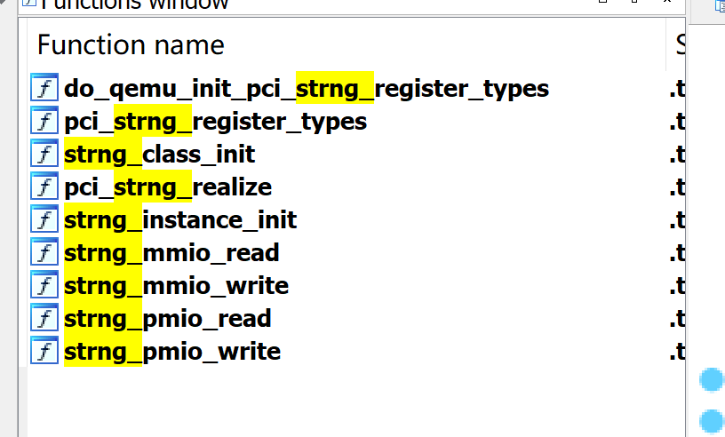

title: blizzardctf2017-strng
date: 2020-2-22
categories:

- PWN
---

这是一道qemu逃逸题目在启动脚本里可以看到-device strng

```
./qemu-system-x86_64 \
    -m 1G \
    -device strng \
    -hda my-disk.img \
    -hdb my-seed.img \
    -nographic \
    -L pc-bios/ \
    -enable-kvm \
    -device e1000,netdev=net0 \
    -netdev user,id=net0,hostfwd=tcp::5555-:22
```
用户名ubuntu,密码passw0rd,登入,lspci可以看到
```
root@ubuntu:~# lspci
00:00.0 Host bridge: Intel Corporation 440FX - 82441FX PMC [Natoma] (rev 02)
00:01.0 ISA bridge: Intel Corporation 82371SB PIIX3 ISA [Natoma/Triton II]
00:01.1 IDE interface: Intel Corporation 82371SB PIIX3 IDE [Natoma/Triton II]
00:01.3 Bridge: Intel Corporation 82371AB/EB/MB PIIX4 ACPI (rev 03)
00:02.0 VGA compatible controller: Device 1234:1111 (rev 02)
00:03.0 Unclassified device [00ff]: Device 1234:11e9 (rev 10)
00:04.0 Ethernet controller: Intel Corporation 82540EM Gigabit Ethernet Controller (rev 03)
```
可以看到有一个设备Unclassified device,可能就是这个设备,lspci -v -s 00:03.0看一下

```
root@ubuntu:~# lspci -v -s 00:03.0
00:03.0 Unclassified device [00ff]: Device 1234:11e9 (rev 10)
	Subsystem: Red Hat, Inc Device 1100
	Physical Slot: 3
	Flags: fast devsel
	Memory at febf1000 (32-bit, non-prefetchable) [size=256]
	I/O ports at c050 [size=8]
```

可以看到存在一个mmio和pmio,mmio地址是febf1000,大小是0xff,pmio的地址是c050,大小是8.
打开ida,在函数窗口搜索strng,可以看到如下



我们要关注的是strng_mmio_read/write和strng_pmio_read/write.

shift+F1调出已经存在的结构体,可以看到STRNGState

```C
struct __attribute__((aligned(16))) STRNGState
{
  PCIDevice_0 pdev;
  MemoryRegion_0 mmio;
  MemoryRegion_0 pmio;
  uint32_t addr;
  uint32_t regs[64];
  void (__cdecl *srand)(unsigned int);
  int (*rand)(void);
  int (__cdecl *rand_r)(unsigned int *);
};
```


关注io部分

```C
uint64_t __fastcall strng_mmio_read(STRNGState *opaque, hwaddr addr, unsigned int size)
{
  uint64_t result; // rax

  result = -1LL;
  if ( size == 4 && !(addr & 3) )
    result = opaque->regs[addr >> 2];
  return result;
}
void __fastcall strng_mmio_write(STRNGState *opaque, hwaddr addr, uint64_t val, unsigned int size)
{
  hwaddr v4; // rsi
  int v5; // ST08_4
  uint32_t v6; // eax
  unsigned __int64 v7; // [rsp+18h] [rbp-20h]

  v7 = __readfsqword(0x28u);
  if ( size == 4 && !(addr & 3) )
  {
    v4 = addr >> 2;
    if ( v4 == 1 )
    {
      opaque->regs[1] = (opaque->rand)(opaque, v4, val);
    }
    else if ( v4 < 1 )
    {
      if ( __readfsqword(0x28u) == v7 )
        (opaque->srand)(val);
    }
    else
    {
      if ( v4 == 3 )
      {
        v5 = val;
        v6 = (opaque->rand_r)(&opaque->regs[2]);
        LODWORD(val) = v5;
        opaque->regs[3] = v6;
      }
      opaque->regs[v4] = val;
    }
  }
}
```

mmio部分的read,hwaddr要与4对齐,通过lspci或者逆向pci_strng_realize可知mmio的size为0xff,所以read的时候还,hwaddr范围也是0-0xff,也就是在读寄存器的时候,hwaddr范围是0-63,而regs长度为64,所以没有什么问题.

在mmio_write里面,同样当addr>>2后

- 等于1的时候,触发rand,将随机数写到regs[1]中
- 等于0的时候,设置随机数种子
- 等于3的时候,调用rand_r,写入regs[3]
- 其余情况直接将随机数写入对应位置,同样v4不能越界

再来看pmio

```C
uint64_t __fastcall strng_pmio_read(STRNGState *opaque, hwaddr addr, unsigned int size)
{
  uint64_t result; // rax
  uint32_t v4; // edx

  result = -1LL;
  if ( size == 4 )
  {
    if ( addr )
    {
      if ( addr == 4 )
      {
        v4 = opaque->addr;
        if ( !(v4 & 3) )
          result = opaque->regs[v4 >> 2];
      }
    }
    else
    {
      result = opaque->addr;
    }
  }
  return result;
}
void __fastcall strng_pmio_write(STRNGState *opaque, hwaddr addr, uint64_t val, unsigned int size)
{
  uint32_t v4; // eax
  __int64 v5; // rax
  unsigned __int64 v6; // [rsp+8h] [rbp-10h]

  v6 = __readfsqword(0x28u);
  if ( size == 4 )
  {
    if ( addr )
    {
      if ( addr == 4 )
      {
        v4 = opaque->addr;
        if ( !(v4 & 3) )
        {
          v5 = v4 >> 2;
          if ( v5 == 1 )
          {
            opaque->regs[1] = (opaque->rand)(opaque, 4LL, val);
          }
          else if ( v5 < 1 )
          {
            if ( __readfsqword(0x28u) == v6 )
              (opaque->srand)(val);
          }
          else if ( v5 == 3 )
          {
            opaque->regs[3] = (opaque->rand_r)(&opaque->regs[2], 4LL, val);
          }
          else
          {
            opaque->regs[v5] = val;
          }
        }
      }
    }
    else
    {
      opaque->addr = val;
    }
  }
}
```

我们可以知道pmio的范围是0-8,基址是0xc050,逆向pmio的读写函数

- read函数,检测size为4,并且按照4对齐,但是这里读取寄存器,就是另一种方法了,这里是opaque->regs[ opaque->addr>> 2],同样只要我们可以控制opaque->addr,便可以对regs读写,看下是不是可控的
- write函数,和上面差不多的功能,只不过写寄存器发生了变化,是opaque->regs[ opaque->addr>> 2]=val,而且在最下面,居然可以设置 opaque->addr,在端口地址为0时,会把val赋值过去,就可以达到控制opaque->addr的目的了,这是就有了任意地址读写了,又因为这里有现成的函数指针,所以可以直接leak和劫持.


EXP:

```C
#include <sys/io.h>

#define STRNG_PORT 0xc050

int main()
{
    iopl(3);
    return 0;
}
```

