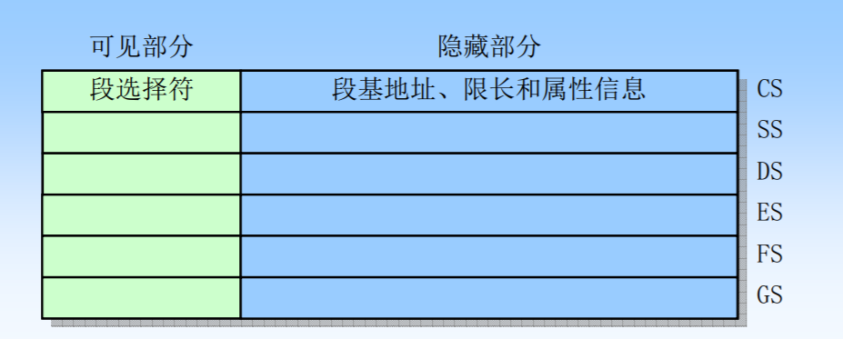
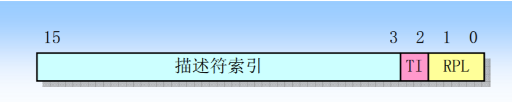
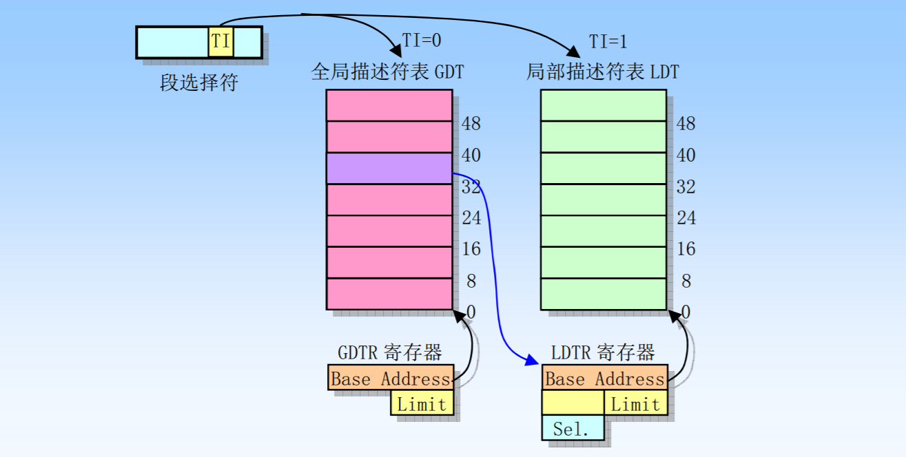
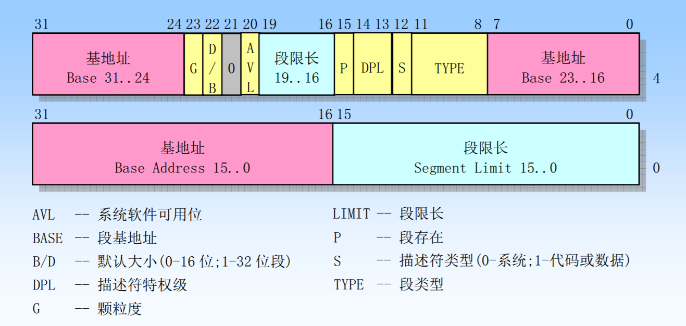
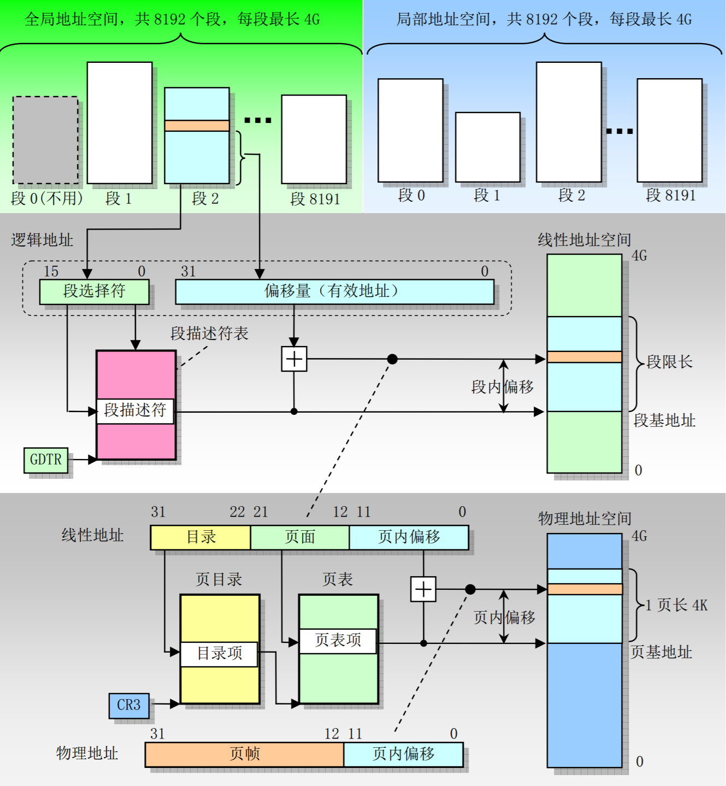
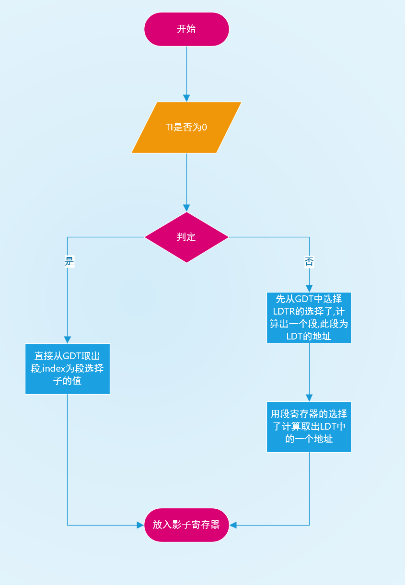
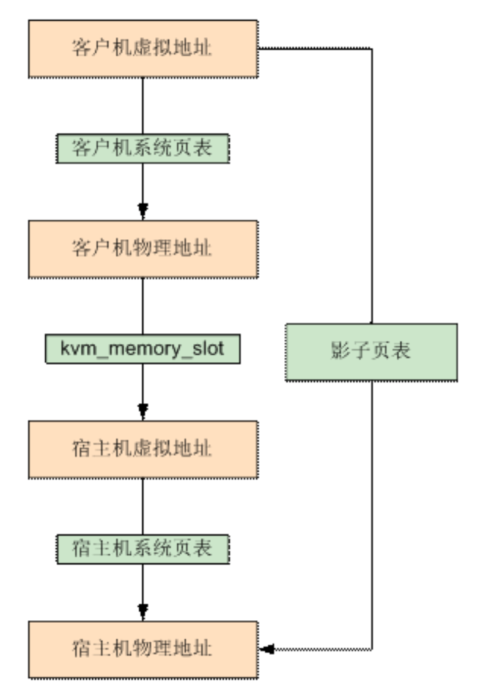
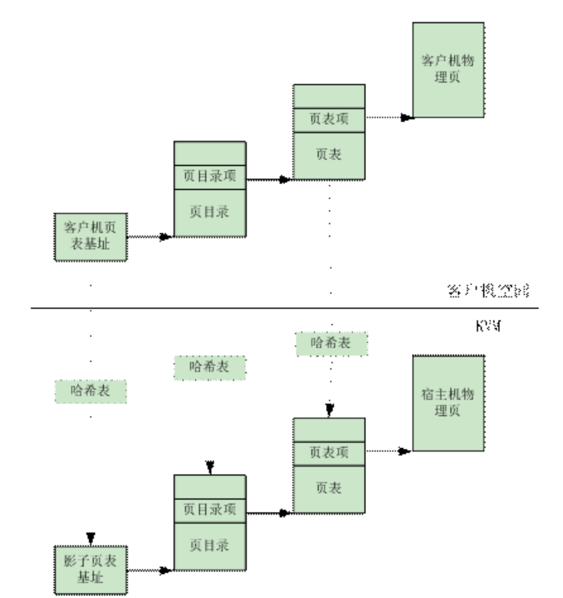

# 传统的内存管理

众所周知,在调试一个程序的时候,会经常发现一些代码处在0x401000处,尽管我们同时调试两个程序,但是他们的内存还是有重合的地方,这里就涉及到了虚拟内存的问题.

为了提高内存的使用率,避免造成内存浪费,并且解决程序间互相干扰的问题,CPU引入了分页和分段的机制,当前时代的CPU存在两种模式,分别是`实模式`和`保护模式`,值得注意的是,在实模式中,所有的地址都是物理地址,并且都是具有RWX权限的,在进入新时代后,对于计算的需求不断提高,所以保护模式就产生了

实模式中对于地址的概念,也就是在微机原理中所学到的概念,例如`cs:ip`,我们在寻址时,实际上访问的是`$cs*0x10+$ip`,并且在实模式中,计算机是没有内存之前的区分的,也没有权限管理.

而在保护模式中,对于地址的概念就不同了,这时以为CPU引入了分段和分页技术,所以对于地址的一些计算也就发生了变化,最明显的是我们有了下面几个概念

- 逻辑地址/虚拟地址:处于保护模式下的CPU的地址,例如用户态应用访问的0x401000
- 线性地址:由于开启了分段机制,所以从逻辑地址,进行分段的转换,所计算得到的地址,就为线性地址,若未开启分页机制,则此地址就为物理地址.
- 物理地址:在开启了分页机制后,对于利用页表对于线性地址转换后得到的地址,即为物理地址.

在80386处理器中,我们以保护模式来说,虽然不是同一时间,还是同一个指令,今天继续来分析`cs:eip`的含义,在这里对应的地址并不是像实模式一样,进行简单的代数运算,继续来说一下内核中才会用到的寄存器CR0,这里着重介绍一下CR0中的两个保护控制位PE/PG

- PE:启动保护(Protection Enable)标志,当设置该位时,就开启了保护模式,当复位时,就恢复了实模式.
- PG:分页(Paging)标志,档次为开启是,就开启了分页机制,复位时,禁止分页机制,此时线性地址就为物理地址.此位仅在PE开启时才有效.

也就是说,我们假设PE=PG=1,那么我们来继续分析`CS:EIP`的含义,在段寄存器中,实际上包含了两个部分,分别是**可见部分**和**不可见部分**,因为在段的管理过程中,涉及到了段的基址,段的属性,段的大小.所以其实我们平时可以看到的是被称作为**段选择符**的部分.





其中TI表示的是GDTR和LDTR的选择,而RPL则表示特权级(ring0-ring3).

```C
Struct SegMent
{
    WORD Selector;     //16位段选择子
    WORD Attributes; //16位属性
    DWORD Base；     //32位基址
    DWORD Limit；    //32位段限长
}
```

而隐藏部分,我们又把它称作影子寄存器,其实他是一个缓冲,在加载描述符索引时,同时为了减少CPU的访问DT的次数.CPU会将段描述符解析加载到影子寄存器中.



也就是这里存放着的描述符.



也就是说,在计算线性地址时,是这个样子的,具体参考下图



涉及到的寄存器有GDTR,CR3,CR0,LDTR.

对于GDT和LDT的不同之处,可以理解为LDT其实就是一个二级Description Table,LDTR其实存着的东西和GDT不同,类似段寄存器,LDTR的目的是选择出GDT中的LDT的段描述符,然后计算LDT的地址,再由段寄存器计算



说完分段机制的实现,再来说一下分页机制的实现,分页机制是在线性地址转换到物理地址时所使用的,这里涉及到了一个CPU中的单元MMU(内存管理单元),MMU由两部分组成,分别是TLB和table walk unit,TLB是一个缓存区,为了使得内存转换的效率更高,在地址转换的时候,需要先访问这个缓存区,由于TLB处在CPU中,所以查TLB的速度是非常的快的,这时如果命中内存,则会检查权限,决定是否报出异常,或者返回物理地址,如果未命中,则会启动table walk uint来便利页表,找到后更新TLB,并且检查权限,返回.

再来说一下mmap,mmap这个系统调用应该也是比较常见的,它一般被用来从文件中映射到一段内存,用户对内存的操作就等于对文件的操作,一般来说,mmap的性能是高于read/write的,因为他们的底层机制是不同的.

在mmap一段内存时,系统做的仅仅是申请了一段对应大小的虚拟内存,并没有将其与物理内存相关联,当我们第一次操作内存的时候,MMU计算后会访问到物理内存,也就是物理页,由于是第一次访问,所以没有进行初始化,会发生缺页中断,然后转到内核处理,这时系统才会真的把文件内容加载到物理内存中

而read/write,其实是对于文件数据进行了两次拷贝,第一次是从文件拷贝到内核的缓冲区,第二次是拷贝到用户态,比mmap多了一次,所以效率自然就慢了.

mmap还存在两种调用方式,分别是有backend和无backend,fd参数决定了这个,当fd是一个正常的文件描述符时,mmap处于有backend模式.此时对于mod来说,又分了两种情况

- **MAP_SHARED**:此时对于文件的操作,实际上是对于进程间可见的,因为对于同一块物理内存,实际上是相同的
- **MAP_PRIVATE**:此时是一个COW机制,在对于内存读写时,实际上操作的是一个复制到缓存中的副本,而不是实际上的物理地址中的数据,如果不主动释放这个区域,会造成内存耗尽,被OOM(Out Of Memory killer)机制杀死.并且最后的数据是不会写写回文件的.

无backend模式就是fd参数无效,并且mod为MAP_ANONYMOUS,此时的内存是由内核所创建的,将内存映射到一个匿名文件,这种情况同样需要我们手动去释放,不然也会触发OOM Killer.

# QEMU的内存虚拟化

在QEMU中,我们涉及到了许多个层面的地址

虚拟机虚拟地址->虚拟机线性地址->虚拟机物理地址->宿主机虚拟地址->宿主机线性地址->宿主机物理地址

或者说是`GVA->GPA==>HVA->HPA`.可以看到光是地址之间的转换,就涉及到了很多步计算,那么在虚拟化的过程中,每一次的读写地址,都会涉及到巨大的转换量,造成性能的损耗.所以这时必须实现高效的内存虚拟化.

在QEMU中,对于内存虚拟化来说,具有两种解决方案:软件实现的影子页表和硬件辅助虚拟化的EPT/NPT技术

## 影子页表

在上面的描述中,我们可以看到,若要实现地址之间的转换,存在着两次查页表的过程,这样的效率是非常的低的,那么影子页表技术,实际上就是将这个两次查询转换的过程,转换成一次查询的过程.

他的实现原理是在转换的过程中,执行了一次GVA->GPA->HPA的时候,将GVA->HPA这个映射存放在一个新的表中,也就是我们所说的影子页表(**sPT** - shadow Page Table).在Guest的每一个进程中,每一个进程都会存在一个影子页表,VMM会将其对应的物理页面设置为写保护,在每次写表时,都会产生一个**异常**,这个异常由VMM**拦截处理**,重新计算映射,并且写回.但是由于这样的**内存开销**过于巨大,需要为**每一个**Guest中的进程维护一个影子页表,并且存在**大量的中断处理**,所以内存开销和CPU的负担都是很重的.



具体来说,这个映射是由许多哈希表构成的,在Guest OS切换进程的时候,客户机操作系统会把待切换进程的页表基址载入 CR3,KVM截获指令,然后把用哈希表计算的下表寻找影子页表,然后填入CR3.



## EPT/NPT硬件辅助内存虚拟化技术

在intel和AMD的处理器中,引入了EPT和NPT机制,类似影子页表,其实也是实现了一个映射表,此时使用的是一个扩展的MMU,它可以在不由软件的控制下,查询两个对应的表.在发生缺页中断的时候,并不是交付给kvm进行内存重新的映射以及影子页表的读写,而是直接按照正常的缺页机制处理


# QEMU的内存虚拟化的代码实现

这里简单拿pci_dma_read进行一个分析

这里调试的是CVE-2015-5165的rtl8139网卡,此漏洞的详细分析文章之前有写过,这里只对pci_dma_read进行一个调用分析

```C
void cfgtx(struct cplus_desc * addr,char * buf)
{
    addr->dw0 |= CP_TX_OWN|CP_TX_EOR|CP_TX_LS|CP_TX_IPCS|CP_TX_LGSEN;
    addr->dw0 += ETH_MTU + ETH_HLEN;
    addr->bufLO = v2p(buf);
    uint32_t paddr = v2p(addr);
    outl(paddr,RTL8139 + TxAddr0);
    outl(0,RTL8139 + TxAddr0 + 4);
}
struct cplus_desc
{
	uint32_t dw0;
	uint32_t dw1;
	uint32_t bufLO;
	uint32_t bufHI;
};
```

这是POC的一小部分,而调试的函数,就是这部分的调用

```C
dma_addr_t cplus_tx_ring_desc = rtl8139_addr64(s->TxAddr[0], s->TxAddr[1]);

    /* Normal priority ring */
    cplus_tx_ring_desc += 16 * descriptor;

    DPRINTF("+++ C+ mode reading TX descriptor %d from host memory at "
        "%08x %08x = 0x"DMA_ADDR_FMT"\n", descriptor, s->TxAddr[1],
        s->TxAddr[0], cplus_tx_ring_desc);

    uint32_t val, txdw0,txdw1,txbufLO,txbufHI;

    pci_dma_read(d, cplus_tx_ring_desc,    (uint8_t *)&val, 4);
    txdw0 = le32_to_cpu(val);
```


在cfgtx中,可以看到将转换后的地址填入TxAddr0和TxAddr1,在调用函数时,从这里面读4个字节,也就是说,传入的参数为设备,物理地址,buf,size

```C
static inline int pci_dma_read(PCIDevice *dev, dma_addr_t addr,
                               void *buf, dma_addr_t len)
{
    return pci_dma_rw(dev, addr, buf, len, DMA_DIRECTION_TO_DEVICE);
}

```

传入后,继续向下层调用pci_dma_rw,其中第五个参数决定了是读还是写,可以看到这里是DMA TO DEVICE,也就是读内存

```C
static inline int pci_dma_rw(PCIDevice *dev, dma_addr_t addr,
                             void *buf, dma_addr_t len, DMADirection dir)
{
    dma_memory_rw(pci_get_address_space(dev), addr, buf, len, dir);
    return 0;
}

```

这里取出了device的address_space(dev->bus_master_as),继续调用

```C
static inline int dma_memory_rw(AddressSpace *as, dma_addr_t addr,
                                void *buf, dma_addr_t len,
                                DMADirection dir)
{
    dma_barrier(as, dir);

    return dma_memory_rw_relaxed(as, addr, buf, len, dir);
}
```

dma_barrier感觉是为了解决多线程加的锁,继续调用下层函数

```C
static inline int dma_memory_rw_relaxed(AddressSpace *as, dma_addr_t addr,
                                        void *buf, dma_addr_t len,
                                        DMADirection dir)
{
    return (bool)address_space_rw(as, addr, MEMTXATTRS_UNSPECIFIED,
                                  buf, len, dir == DMA_DIRECTION_FROM_DEVICE);
}
```

还是一样的简洁,只不过这里加入了一个MEMTXATTRS_UNSPECIFIED

```C
MemTxResult address_space_rw(AddressSpace *as, hwaddr addr, MemTxAttrs attrs,
                             uint8_t *buf, int len, bool is_write)
{
    if (is_write) {
        return address_space_write(as, addr, attrs, buf, len);
    } else {
        return address_space_read_full(as, addr, attrs, buf, len);
    }
}
```

调用到了这里,也就是address_space_rw,这里就很眼熟了,hitcon2017的题目就是基于这个函数实现的

# 参考

https://www.ibm.com/developerworks/cn/linux/l-cn-kvm-mem/index.html  KVM 内存虚拟化及其实现

https://zhuanlan.zhihu.com/p/69828213 虚拟化技术 - 内存虚拟化（一）

https://zhuanlan.zhihu.com/p/65298260

https://zhuanlan.zhihu.com/p/65348145

<<Linux内核0.11完全注释>>

